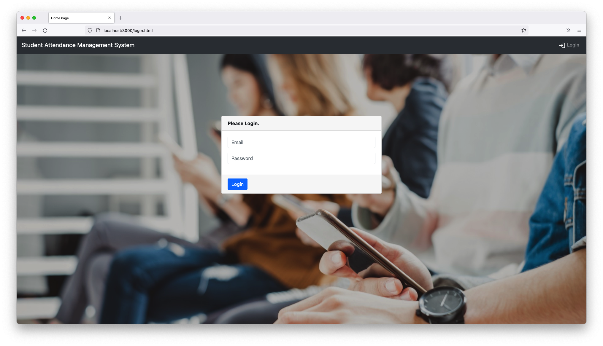
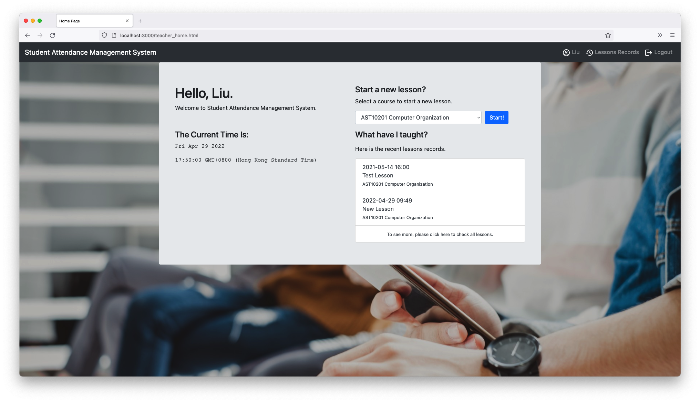
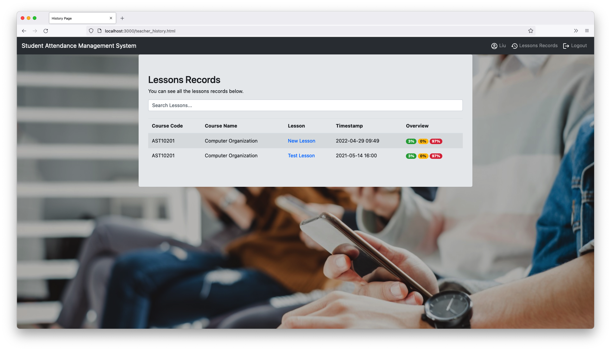
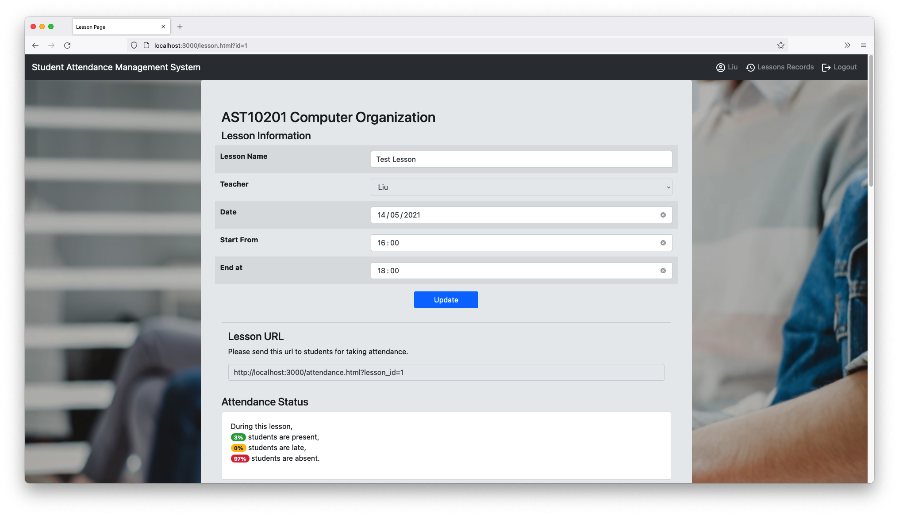
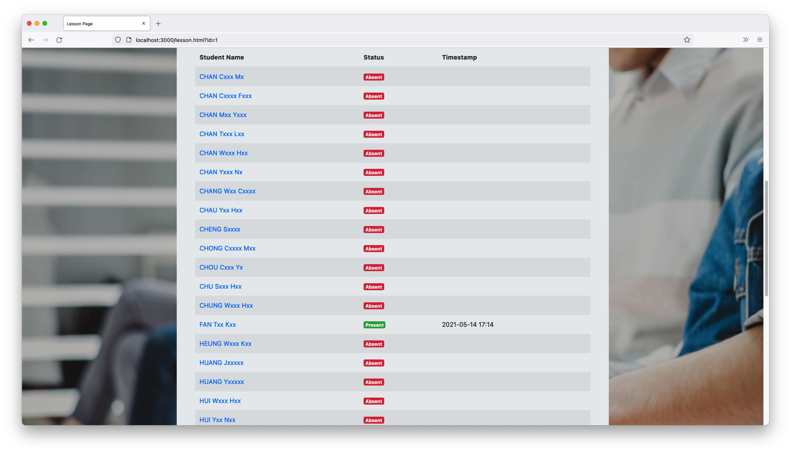
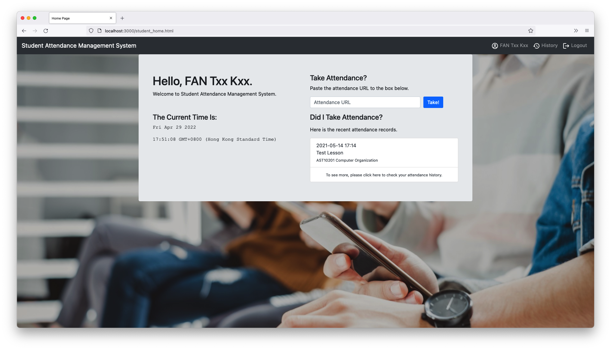
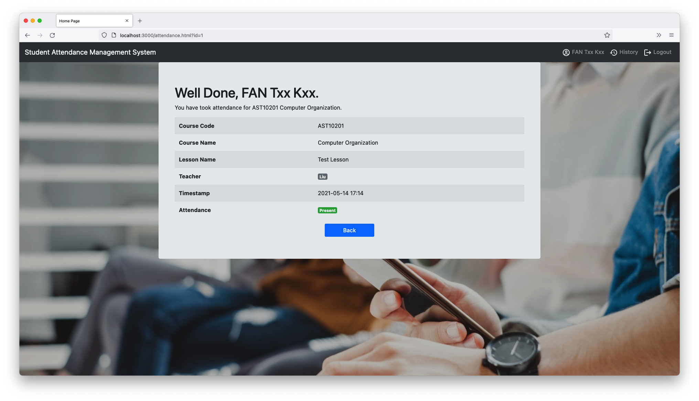
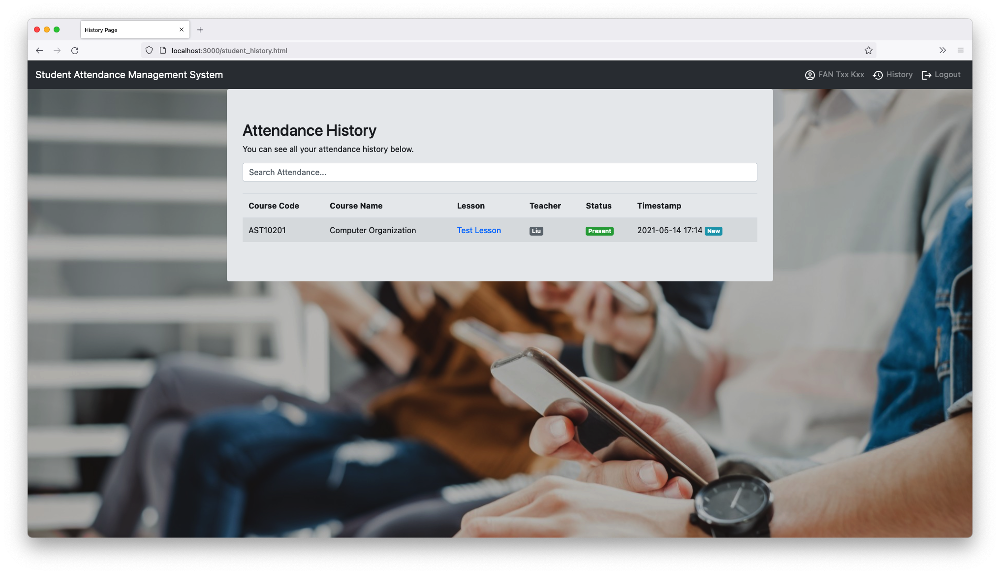

This is the `Java` version of this project. [Click here](https://github.com/redfrogsss/attendance-system-nodejs) to check out the `ExpressJS` version of this project.

# Student Attendance Management System (SAMS)
SAMS - a Student Attendance Management System built with [Java GlassFish](https://glassfish.org/), [Bootstrap](https://getbootstrap.com/), [JQuery](https://jquery.com/) and [MySQL](https://www.mysql.com/).

## Get Started

To start with, you must install [NetBeans](https://netbeans.apache.org/) with `GlassFish Server` and [MySQL](https://dev.mysql.com/downloads/) with `MySQL Shell` on your computer.

1. Import the project folder into Netbeans.
2. Start MySQL Server and use `MySQL Shell` to input the content of `database.sql` to the MySQL server.
3. In Netbeans, choose `Run > Run Project`.
4. Wait a minutes and open [http://localhost:8080](http://localhost:8080) with your browser to see the result.

## Demo Teacher Account
- username: `liu@test.com`
- password: `testes`

## Demo Student Account
- username: `ftk@test.com`
- password: `testes`

## Learn More

This is a Individual Assignment Project built by [Jacky Fan](https://github.com/redfrogsss) in 2021 for the Course AST20201 Web Programming. 

The following tech is used in this project.
- [Java GlassFish](https://glassfish.org/) - the backend solutions of this project.
- [Bootstrap](https://getbootstrap.com/) - the UI solutions of this project.
- [JQuery](https://jquery.com/) - the client-side programming solutions of this project.
- [MySQL](https://www.mysql.com/) - the database of this project.